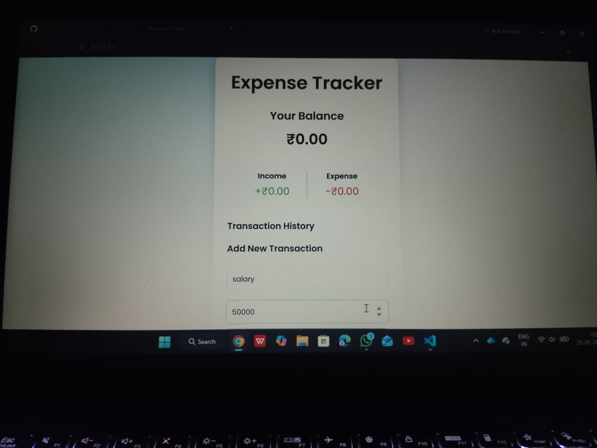

# Expense Tracker

A responsive Expense Tracker web application built using HTML, CSS, and JavaScript that helps users manage income and expenses efficiently with real-time balance updates and LocalStorage support.

---

## 🚀 Features

- Add income and expense transactions
- Real-time balance calculation
- Income and expense summary
- Delete transactions
- Data persistence using LocalStorage
- Responsive user interface

---

## 🛠️ Technologies Used

- HTML5
- CSS3
- JavaScript

---

## 📂 Project Structure

```bash
Expense-tracker/
│
├── index.html
├── style.css
├── script.js
└── README.md
```

---

## ⚙️ How It Works

1. Enter transaction description and amount
2. Positive amount → Income
3. Negative amount → Expense
4. Transactions are displayed dynamically
5. Balance updates automatically
6. Data is stored using LocalStorage

---

## 📸 Preview



---

## 👨‍💻 Author

**Karthik**

- GitHub: https://github.com/kartheek-r

---

## ⭐ Project Status

Completed and deployed successfully.
